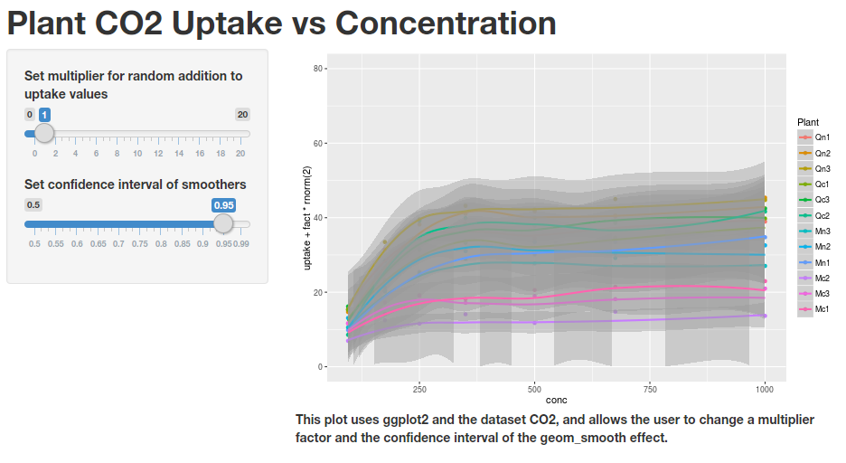

## CO2 data

### The widget I have created uses the CO2 data. Here are the first few rows of the dataset:


```r
        data(CO2)
        head(CO2, n=4)
```

```
##   Plant   Type  Treatment conc uptake
## 1   Qn1 Quebec nonchilled   95   16.0
## 2   Qn1 Quebec nonchilled  175   30.4
## 3   Qn1 Quebec nonchilled  250   34.8
## 4   Qn1 Quebec nonchilled  350   37.2
```

---

## Interactive Elements

The widget has two interactive elements:

1. a slider bar that is used as a multiplier in this equation: uptake * (1 + multiplier * rnorm(1))
2. a slider bar that can be used to adjust the confidence interval of the geom_smooth() lines. Note that the default is 0.95

---

## Screenshot



---

## It's actually pretty useless!

* Each time you change a slider the random numbers are regenerated.
* Not that useful anyway!

### Does anybody have any questions?
